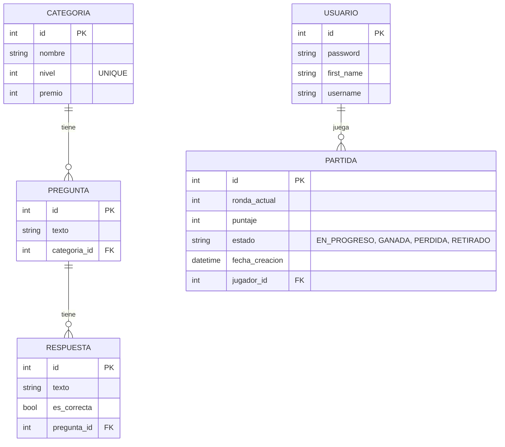

# Trivia Challenge - Prueba Técnica Ciel

Juego de Trivia de 5 rondas con niveles de complejidad progresiva. Construido con **Django (Python)** y **Vanilla JavaScript**.

## 1. Guía de Instalación y Configuración

### Prerrequisitos
- Python 3.10 o superior.

### Pasos de Instalación
1. Clonar el repositorio.
2. Crear un entorno virtual:
   ```bash
   python -m venv venv
   ```
3. Activar el entorno virtual:
   - En Windows: `.\venv\Scripts\activate`
   - En Mac/Linux: `source venv/bin/activate`
4. Instalar las dependencias:
   ```bash
   pip install -r requirements.txt
   ```
5. Aplicar migraciones a la base de datos (SQLite por defecto):
   ```bash
   python manage.py migrate
   ```
6. Crear un superusuario para administrar el juego:
   ```bash
   python manage.py createsuperuser
   ```
7. Iniciar el servidor local:
   ```bash
   python manage.py runserver
   ```
8. Acceder al juego en `http://127.0.0.1:8000/` y al panel de administración en `http://127.0.0.1:8000/admin/`.

### Configuración del Juego (Banco de Preguntas)
Para que el juego funcione, el administrador debe registrar las categorías, premios y preguntas:

1. **Inicia sesión como Superusuario:** Ve a `http://127.0.0.1:8000/admin/` e ingresa las credenciales del superusuario que creaste en el paso anterior.
2. **Crear Categorías (Dificultades):** 
   - En el menú lateral, haz clic en **Categorías** > **Añadir**.
   - Crea 5 categorías correspondientes a los 5 niveles (ej: Nivel 1 - Básico, Nivel 2 - Fácil, Nivel 3 - Intermedio, Nivel 4 - Difícil, Nivel 5 - Experto).
   - Asigna a cada una su respectivo **Nivel** (del 1 al 5) y el **Premio** que otorgará.
3. **Crear Preguntas y Respuestas:**
   - Ve a **Preguntas** > **Añadir**.
   - Escribe el texto de la pregunta y selecciona a qué **Categoría (Nivel)** pertenece.
   - En la misma pantalla (abajo, en los "Inlines"), encontrarás los espacios para las respuestas.
   - Escribe 4 opciones de respuesta para la pregunta y marca la casilla **"Es correcta"** únicamente en la respuesta verdadera.
   - Haz clic en "Guardar". (Crea al menos 5 preguntas, una para cada nivel).

## 2. Documentación de Arquitectura de la Solución

El proyecto sigue un patrón de arquitectura **MVT (Model-View-Template)** propio de Django, complementado con una arquitectura tipo **SPA (Single Page Application)** en el frontend durante la partida interactiva.

### Estructura del Proyecto (Mapeo MVT)
En Django, a diferencia de otros frameworks MVC tradicionales que obligan a usar carpetas físicas para todo, la estructura MVT está diseñada para ser más directa y modular mediante archivos y carpetas específicas dentro de cada aplicación (`trivia`):

```text
Prueba_Tecnica_Ciel/
│
├── config/                  # Configuración del proyecto Django (Settings, URLs globales)
│
└── trivia/                  # Aplicación de la Trivia
    ├── models.py            # [MODELO] Definición de las tablas SQL (Categoría, Pregunta, etc.)
    ├── views.py             # [VISTA] Lógica del negocio, APIs JSON y endpoints de renderizado
    │
    ├── templates/           # [TEMPLATES] Archivos de presentación HTML
    │   └── trivia/
    │       ├── login.html
    │       ├── dashboard.html
    │       └── juego.html
    │
    ├── static/              # Archivos estáticos
    │   ├── css/styles.css   # Hojas de estilo CSS (Diseño responsivo premium)
    │   └── js/
    │       ├── auth.js      # Lógica de login/registro (DOM)
    │       └── game.js      # Lógica interactiva del juego (Temporizador, Fetch API)
    │
    ├── services.py          # Capa de servicio (Lógica desacoplada del juego)
    └── tests.py             # Pruebas unitarias
```

* **Modelos (M):** Se definen en `trivia/models.py`. Representan las entidades y reglas de la base de datos.
* **Vistas (V):** Se definen en `trivia/views.py`. En Django, la "Vista" actúa como el controlador, procesando las solicitudes del cliente y retornando respuestas (HTML o JSON).
* **Templates (T):** Residen en `trivia/templates/trivia/`. Son las plantillas HTML que renderizan la interfaz del usuario.

* **Backend (Django):** Maneja la base de datos (SQLite), la seguridad (Protección CSRF, Autenticación), el historial de partidas del jugador, y provee una API JSON (`/api/...`) para gestionar el ciclo de vida de la trivia.
* **Frontend (HTML/CSS/JS):** Interfaz moderna, responsiva y asíncrona. Diseñada con **Vanilla CSS** y **Vanilla JS**. Durante el juego, la pantalla no se recarga; se usa `fetch` para enviar las respuestas al servidor y validar el estado y tiempo.

## 3. Documentación de Casos de Uso

| Caso de Uso | Descripción | Actor |
|-------------|-------------|-------|
| **Configurar Juego** | Crear categorías, niveles, premios, preguntas y asignar las respuestas correctas e incorrectas. | Administrador |
| **Registrar Jugador** | El usuario proporciona nombre, identificación y contraseña. | Jugador |
| **Iniciar Sesión** | El usuario entra con su número de identificación y contraseña. | Jugador |
| **Iniciar Partida** | Crea un nuevo registro de partida empezando en la ronda 1 con 0 puntos. | Jugador |
| **Responder Pregunta** | Elegir una opción antes de 60 segundos. Si es correcta, gana los puntos de la categoría y avanza de nivel. | Jugador |
| **Retirarse Voluntariamente** | El jugador elige abandonar antes de responder, conservando los puntos acumulados. | Jugador |
| **Fin de Juego Forzado** | El jugador elige mal una respuesta o el temporizador llega a cero. Pierde todos sus puntos en la partida actual. | Sistema / Jugador |
| **Ver Historial** | Visualizar las partidas pasadas, su puntaje y su estado final (GANADA, PERDIDA, RETIRADO). | Jugador |

## 4. Diagrama Entidad-Relación (Base de Datos)


